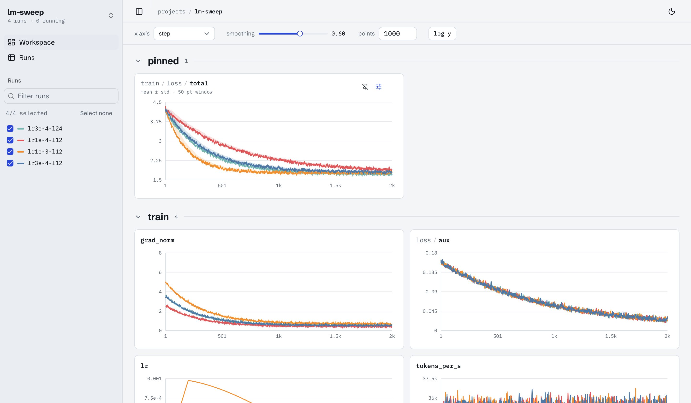

# log-ui

[](https://github.com/AadityaSalgarkar/log-ui/actions/workflows/ci.yml)
[](LICENSE)

A self-hosted, wandb-style dashboard for experiments logged with [trackio](https://github.com/gradio-app/trackio).
One Python process serves a read-only JSON API over trackio's sqlite store and a prebuilt React app.
No Node at runtime, no accounts, no cloud.

**Site:** <https://aadityasalgarkar.github.io/log-ui/> · **For LLMs:** [`llms.txt`](https://aadityasalgarkar.github.io/log-ui/llms.txt)



## Install and run

```
uv tool install git+https://github.com/AadityaSalgarkar/log-ui    # or: pip install git+https://github.com/AadityaSalgarkar/log-ui
log-ui                                                            # serves ~/.cache/huggingface/trackio at http://127.0.0.1:8765
log-ui --dir /path/to/store --project my-project --open
```

No runs of your own yet? Write a synthetic store with a small learning-rate sweep and open it:

```
git clone https://github.com/AadityaSalgarkar/log-ui && cd log-ui && uv sync
uv run python scripts/demo_store.py /tmp/log-ui-demo
uv run log-ui --dir /tmp/log-ui-demo --project lm-sweep
```

## Docker

Build the image yourself from the public source (no registry, nothing to clone), then run it:

```
docker build -t log-ui https://github.com/AadityaSalgarkar/log-ui.git

docker run --rm -p 127.0.0.1:8765:8765 log-ui                       # bundled demo store
docker run --rm -p 127.0.0.1:8765:8765 \
  -v ~/.cache/huggingface/trackio:/data:ro \
  --read-only --tmpfs /tmp --cap-drop ALL --security-opt no-new-privileges \
  log-ui                                                            # your runs, read-only
```

Or, from a clone, `docker compose up` (store path via `TRACKIO_STORE`, port via `LOG_UI_PORT`). What the
container can do, by construction:

- **Read your store, never write it.** It is mounted `:ro`. A store on a read-only mount is read through a
  private snapshot in the container's `/tmp`, so rows still in trackio's WAL file are included.
- **Nothing else on disk.** With `--read-only` (the default in `compose.yaml`) the root filesystem is
  immutable; only an in-memory `/tmp` is writable.
- **Minimal surface.** Alpine plus a Python virtualenv: no compilers, no Node, no shell tools beyond
  BusyBox. Always runs as an unprivileged user (uid 10001); `--cap-drop ALL` (default in `compose.yaml`)
  removes every Linux capability.
- **Local only.** The examples publish the port on `127.0.0.1`; log-ui makes no outbound connections.

## What you get

- **Projects**: every trackio project in the store with its run count and last write.
- **Workspace**: pick runs in the sidebar; every logged key gets a chart, grouped by prefix (`train/…`, `val/…`),
  with keys shown as paths (`train / loss / total`). Global smoothing (EMA), step / relative / wall-clock x-axis,
  log y, and a free-form point budget per series. Pin charts to the top.
- **Per-chart settings**: a mean ± std or min–max band over a trailing window of N raw points (never looks
  ahead), and fixed x/y limits. Settings persist per project in the browser.
- **Charts**: a synced cursor across charts, a tooltip on the chart under the mouse, and a full-screen view
  with a range brush.
- **Runs table**: status, steps, duration, the config columns that differ between runs, sorting, filtering
  and multi-select.
- **Run page**: charts, flattened config, last value of every key, and system metrics when logged.
- **Views**: declarative panels (ladder, heatmap, table, line grid, stats) contributed by plugins, for
  project-specific comparisons.
- Refreshes when a selected run logs new rows; dark and light themes; page state lives in the URL.

## The trackio contract

log-ui is read-only and does not import trackio. Its only I/O with trackio is the on-disk sqlite store, and
all of that access lives in one module, [`log_ui/contract.py`](log_ui/contract.py), which declares:

- the files it reads: `<store>/<project>.db` for canonical project names (`[A-Za-z0-9_-]+`), excluding
  trackio's `registry-*` databases;
- the tables and columns it reads (`configs`, `metrics`, `system_metrics`) and how their values are encoded;
- the trackio versions it is verified against (`TRACKIO_VERSIONS`, currently `>=0.38,<0.40`).

Connections are opened with `mode=ro`, and each one's schema is checked when it opens. If a store lacks a
declared column, log-ui returns an `unsupported trackio store` error instead of guessing. On a read-only
filesystem, where SQLite cannot create the `-shm` file a WAL database needs, log-ui reads a snapshot of the
database and its WAL from the temp directory instead. To delete, rename or
move runs, use trackio (`trackio.Api().runs(project)`); log-ui picks up the change on its next read.

## Configuration

| Flag | Environment | Default |
|---|---|---|
| `--dir` | `LOG_UI_DIR`, then `TRACKIO_DIR` | `~/.cache/huggingface/trackio` |
| `--host` | `LOG_UI_HOST` | `127.0.0.1` |
| `--port` | `LOG_UI_PORT` | `8765` |
| `--project` | `LOG_UI_PROJECT` | none (opens the project list) |
| `--views module:function` (repeatable) | `LOG_UI_VIEWS` (comma-separated) | entry points in `log_ui.views` |
| `--stale-seconds` | | `120` (a run that logged within this window is "running") |
| `--open` | | open a browser |

Flags override environment variables. The server binds to localhost by default; to reach it on a remote
machine, forward the port (`ssh -L 8765:localhost:8765 box`) rather than binding to `0.0.0.0`.

## API

All endpoints are read-only, return JSON under `/api`, and are documented interactively at `/docs`.

| Method | Path | Purpose |
|---|---|---|
| GET | `/api/health` | version, store dir, supported trackio range |
| GET | `/api/projects` | projects with run counts and last write |
| GET | `/api/projects/{p}/runs` | runs with status, last step, flattened config, summary |
| GET | `/api/projects/{p}/runs/{run}` | one run plus its keys and eval steps |
| GET | `/api/projects/{p}/keys` | metric keys with prefix and run counts |
| GET | `/api/projects/{p}/metrics?runs=a,b&keys=k1,k2&x=step&smoothing=0.5&max_points=1000&bands=k1:10` | series per run and key; `bands` adds a trailing-window mean/std/min/max |
| GET | `/api/projects/{p}/system?runs=a,b&bands=gpu:10` | system metrics (GPU, CPU) when logged |
| GET | `/api/projects/{p}/views` | view specs from plugins |
| GET | `/api/projects/{p}/views/{id}?runs=a,b&metric=m&point=last` | resolved panels |

## Views (plugins)

A view provider is a function `provide(project, runs) -> list[ViewSpec]`. Register it under the entry-point
group `log_ui.views` in your package, or pass `--views my_module:provide`. `runs` carries each run's flattened
config and summary, so a provider can derive categories from the config (datasets, species, seeds) and map
them to metric keys with templates like `val/{category}/{metric}`. Panel types: `ladder` (one line per run
across ordered categories), `heatmap` (runs × categories), `table`, `lines` (small multiples over steps) and
`stats`. See [`log_ui/views.py`](log_ui/views.py) for the dataclasses.

## Development

```
uv sync                                  # backend + test deps (tests write real stores with trackio)
uv run pytest
uv run --with ruff ruff check log_ui tests && uv run --with ruff ruff format --check log_ui tests

cd web
npm ci
npm run dev                              # Vite on :5173, proxies /api to http://127.0.0.1:8765
npm run lint && npm run typecheck && npm test
npm run build                            # writes ../log_ui/static (committed, shipped in the wheel)
```

The built app in `log_ui/static` is committed so that installing needs no Node; CI checks it matches the
sources. The project site lives in [`docs/`](docs/) and is published with GitHub Pages.

## Roadmap

Media and table panels, artifacts, traces, alerts, sweep pages, run tags and notes, parameter importance,
report authoring.

## License

[MIT](LICENSE).
